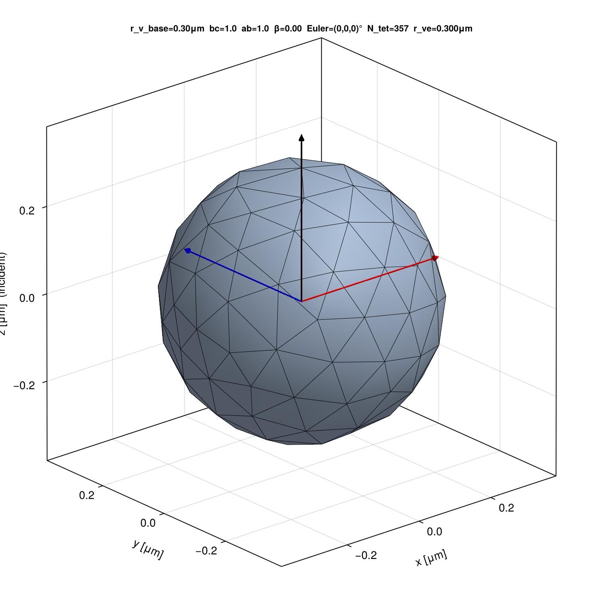
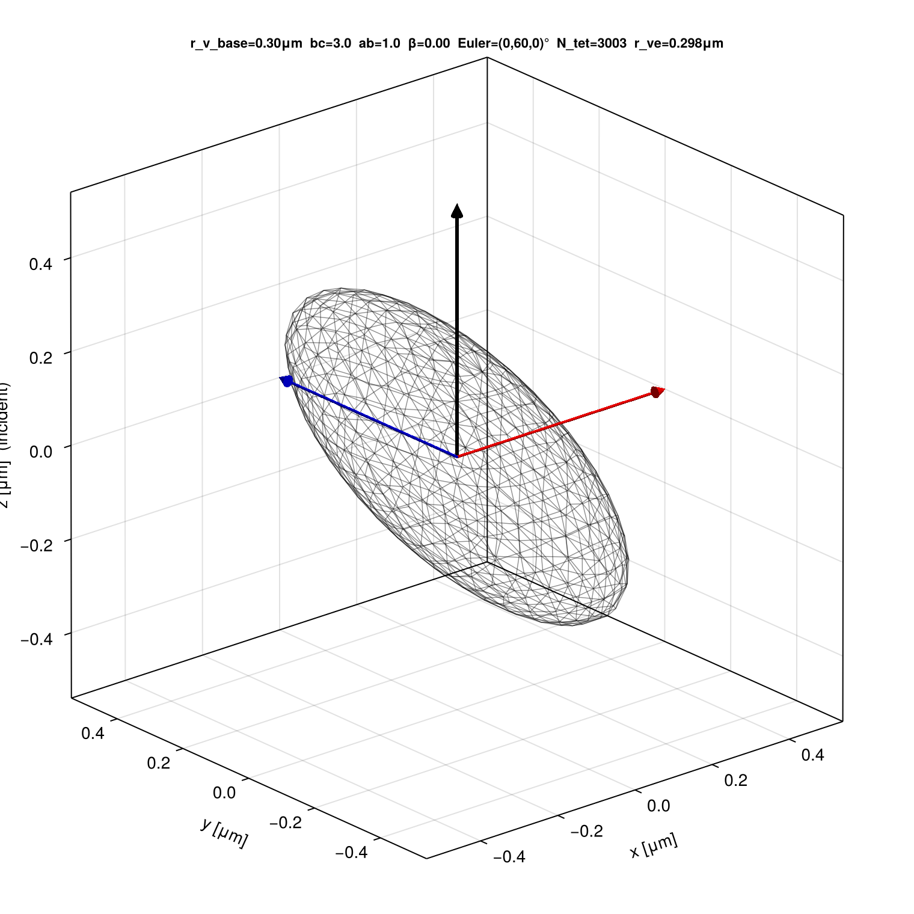
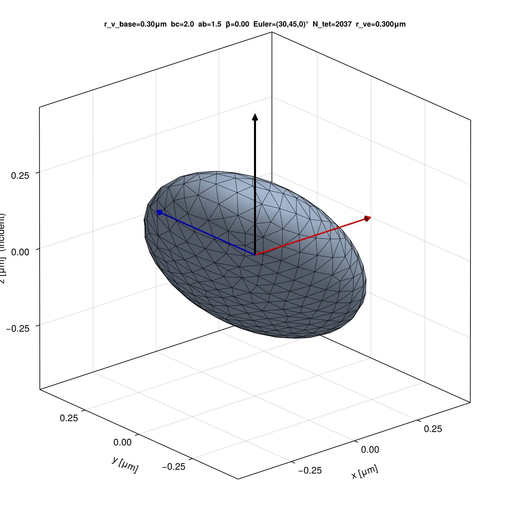
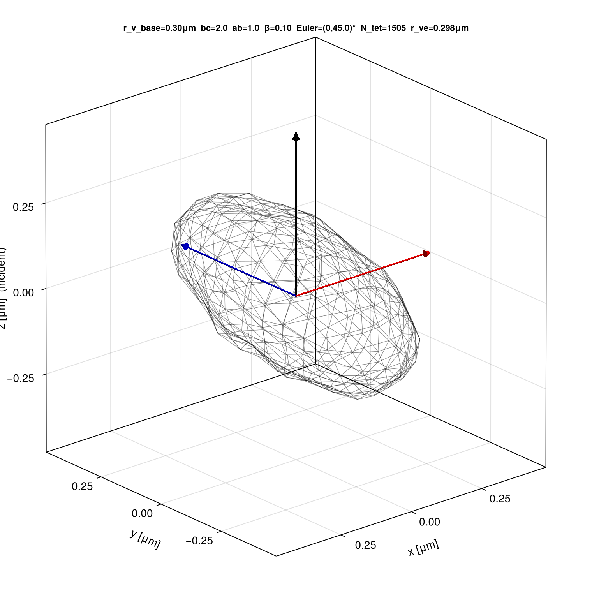
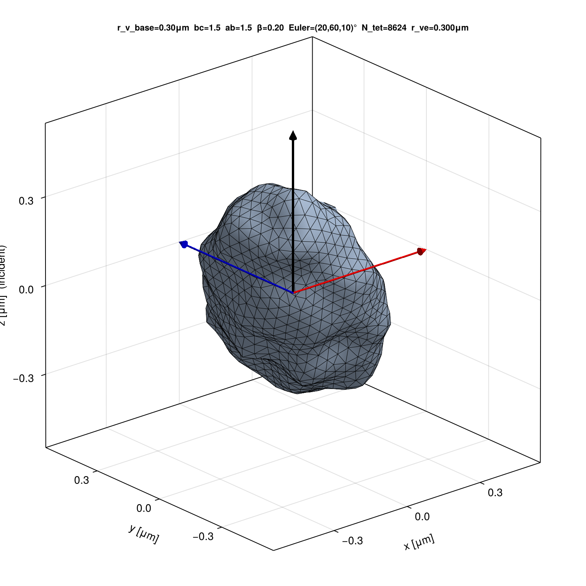

# block-VIEM.jl

[](https://github.com/NobuhiroMoteki/block-VIEM.jl/releases)
[](LICENSE)
[](https://julialang.org/)

A Julia implementation of the **Volume Integral Equation Method (VIEM)** for
electromagnetic scattering by arbitrarily shaped, high-contrast dielectric
particles (e.g., iron-oxide aggregates, rough gold nanoparticles).

block-VIEM.jl is designed as a **higher-accuracy successor** to
[`block-DDA_Py`](https://github.com/NobuhiroMoteki/block-DDA_Py),
targeting scattering problems where DDA does not converge or provides
insufficient accuracy (high refractive-index contrast, plasmonic
particles, extreme aspect ratios). The two codes share the same physical
input conventions, HDF5 output schema, and CAS-v2 observable definitions,
so downstream analysis pipelines work with either without modification.

## Features

1. **Higher accuracy per DOF than DDA.** Tetrahedral discretization with
   SWG (half-SWG) basis functions and Duffy-transform singular integration
   achieves 10-12x better accuracy per degree of freedom than DDA on
   equivalent problems.
2. **AIM/FFT-accelerated block-Krylov solver.** The Adaptive Integral
   Method (AIM) computes matrix-vector products in O(N log N) via FFT.
   Block GMRES (default since v0.7.1) / Block BiCGSTAB solve all
   particle orientations simultaneously. AIM grid pitch is auto-detected
   from the mesh.
3. **Multi-orientation batch solve.** Supports deterministic uniform Euler
   angle grids on SO(3) (`N_alpha` x `N_beta` x `N_gamma`), identical to
   block-DDA_Py. **Spheroid mode** (`ab_ratio=1`, `beta=0`) solves only
   `N_beta` orientations and fills the full grid analytically via the
   alpha-expansion `S_theta(alpha) = A + B*exp(+2j*alpha)`.
4. **Birefringent (anisotropic) materials.** Diagonal permittivity tensor
   `eps_p = diag(eps_x, eps_y, eps_z)` is supported throughout the solver,
   post-processing, and sweep scripts.
5. **Gaussian Random Ellipsoid (GRE) shape model.** Parametric irregular
   particle shapes `(r_v_base, bc_ratio, ab_ratio, beta)` matching
   block-DDA_Py (Muinonen & Pieniluoma 2011, JQSRT). Tetrahedral meshes
   are generated automatically via Gmsh with adaptive mesh size based on
   wavelength, geometry, and surface-deformation correlation length.
6. **Sphere-aggregate targets.** Fused clusters of spheres are handled
   as first-class geometries (`SphereAggregate`, `mesh_sphere_aggregate`).
   Built-in constructors cover linear chains, planar arrays, and
   FCC / BCC / HCP clusters (`make_linear_chain`, `make_planar_array`,
   `make_fcc_cluster`, `make_bcc_cluster`, `make_hcp_cluster`);
   arbitrary monomer-center/radius lists (e.g. random fractal-like
   aggregates from the `aggregate_generator_PTSA` HDF5 files) are
   loaded via `load_ptsa_h5`. Overlap between adjacent monomers is
   specified through an interpretable `neck_ratio` (contact-circle
   radius ÷ monomer radius). A single conforming tetrahedral mesh
   spans the entire aggregate so the internal D-field is resolved
   across every neck.
7. **CAS-v2 observables.** Computes the polarized complex forward-scattering
   amplitudes `S(0)_theta`, `S(0)_phi` (PCAS) and the complex
   backward-scattering amplitude `S(180)` (OCBS), plus `C_ext`, `C_abs`,
   `C_sca`.
8. **Production sweep with resume.** `run_viem.jl` performs multi-dimensional
   parameter sweeps (wavelength x refractive index x shape x orientation),
   writes results to HDF5 in the block-DDA_Py-compatible schema, and
   resumes from partially completed files. On solver failure, fills NaN and
   continues (matching block-DDA_Py).
9. **Mie reference.** Each sweep condition is compared to the Mie solution
   for the volume-equivalent sphere with axis-averaged refractive index.

### Validation

- **Plasmonic Au Mie sphere** (`benchmarks/cas_v2/au_sphere_mie.jl`):
  Johnson & Christy 1972 gold at wl_0 = 0.638 um
  (m_p = 0.17525 + 3.4830i, eps_p = -12.10 + 1.22i, x = 0.63).
  Both dense (LU) and AIM-BiCGSTAB solvers achieve sub-1 % on all
  five observables at N = 2134 half-SWG DOFs (single-threaded wall
  times; see § *Parallel execution* for the 2–3 × speed-up at 4+
  Julia threads):

  | lc [um] | N    | method       | C_ext  | C_abs  | C_sca  | S_fw_mean | S_bk   | time  |
  |---------|------|--------------|--------|--------|--------|-----------|--------|-------|
  | 0.020   | 2134 | dense (LU)   | 0.65 % | 0.01 % | 0.75 % | 0.58 %    | 0.28 % | 17 s  |
  | 0.020   | 2134 | AIM-BiCGSTAB | 0.25 % | 0.44 % | 0.37 % | 0.32 %    | 0.11 % | 43 s  |
  | 0.014   | 4932 | dense (LU)   | 0.34 % | 0.08 % | 0.41 % | 0.32 %    | 0.15 % | 68 s  |
  | 0.014   | 4932 | AIM-BiCGSTAB | 0.15 % | 0.24 % | 0.22 % | 0.18 %    | 0.07 % | 105 s |

- **Spheroid symmetry** (`benchmarks/cas_v2/spheroid_ar3.jl`): the
  analytical α-expansion `S_θ(α) = A + B·exp(+2jα)` holds at machine
  precision (~5×10⁻¹⁵) on an oblate AR = 3 mesh.
- **Cross-validation vs block-DDA_Py (spheroid)**
  (`benchmarks/cas_v2/dda_comparison/`): oblate AR = 3 spheroid
  (D_ve = 0.40 μm, m_p = 1.5, λ₀ = 0.638 μm), VIEM and DDA agree to
  ~2 % on the complex polarimetric forward amplitudes at two tilt
  angles (β = π/4, π/2).
- **GRE cross-validation vs block-DDA_Py (β > 0)**
  (`benchmarks/cas_v2/gre_comparison/`): three GRE shapes with surface
  deformation (β = 0.10–0.20, bc_ratio = 1.5–3.0, ab_ratio = 1.0–1.5),
  m_p = 1.5 + 0.01i, λ₀ = 0.638 μm, at two tilt angles. The same
  Gaussian random field is shared between DDA and VIEM. Agreement:

  | Case | b/c | a/b | β    | ΔS_θ rel.  | ΔS_φ rel.  |
  |------|-----|-----|------|------------|------------|
  | A    | 2.0 | 1.0 | 0.10 | 0.5–0.7 %  | 0.1–0.3 %  |
  | B    | 3.0 | 1.0 | 0.15 | 2.0–2.6 %  | 1.7–1.8 %  |
  | C    | 1.5 | 1.5 | 0.20 | 1.2–1.6 %  | 1.6–1.8 %  |

- **Anisotropic ε_p cross-validation vs block-DDA_Py**
  (`benchmarks/cas_v2/aniso_comparison/`): sphere (r_ve = 0.20 μm,
  λ₀ = 0.638 μm) with diagonal-tensor refractive index. The same
  `m_p_xyz = [m_x, m_y, m_z]` is passed to both DDA and VIEM:

  | Case   | m_p               | ΔS_θ rel.  | ΔS_φ rel.  |
  |--------|-------------------|------------|------------|
  | iso    | [1.5, 1.5, 1.5]  | 1.3–2.4 %  | 2.4 %      |
  | mild   | [1.55, 1.5, 1.45] | 1.2–3.5 %  | 2.3–2.6 %  |
  | strong | [1.6, 1.5, 1.4]  | 0.7–5.0 %  | 2.3–2.9 %  |

## When to use block-VIEM.jl vs block-DDA_Py

block-DDA_Py and block-VIEM.jl solve the same physics and produce the
same observables in the same HDF5 format. The choice depends on the
refractive-index contrast and particle geometry.

### Low contrast (|m_p| < 2): use block-DDA_Py

For weakly scattering particles (e.g. mineral dust, m_p ~ 1.5), DDA
is far more efficient. Benchmark on a Mie sphere (r = 1 um,
m_p = 1.5 + 0.01i, wl_0 = 10 um, x = 0.63, single orientation,
Intel i7-1265U, single-threaded — `t_setup` drops by ~2.5 × on a
4-thread machine after the parallel setup added in v0.6.0; see
§ *Parallel execution*):

| Code          | N DOF  | C_abs error | t_setup  | t_solve  | memory  |
|---------------|--------|-------------|----------|----------|---------|
| block-DDA_Py  | 302    | 1.7 %       | < 0.1 s  | < 0.1 s  | 6 MB    |
| block-DDA_Py  | 4 419  | 0.8 %       | < 0.1 s  | 0.1 s    | 64 MB   |
| block-VIEM.jl | 589    | 8.4 %       | 7.9 s    | 2.2 s    | 6 MB    |
| block-VIEM.jl | 1 986  | 3.6 %       | 23.9 s   | 0.7 s    | 63 MB   |
| block-VIEM.jl | 7 868  | 1.4 %       | 145.8 s  | 2.7 s    | 991 MB  |

DDA achieves 1.7 % accuracy with 302 dipoles in under 0.1 s.
VIEM requires ~2 000 DOFs and ~10 s of setup (4 threads) for
comparable accuracy. The DDA cubic lattice has an exact FFT-MVP with
no near-field precorrection, so setup cost is effectively zero.

**Recommendation:** For |m_p/m_m| < 2 and moderate aspect ratios,
block-DDA_Py is the right tool.

### High contrast (|m_p| > 3, plasmonic): use block-VIEM.jl

DDA convergence degrades sharply at high refractive-index contrast.
Same benchmark sphere with m_p = 3.17 + 0.16i (eps_p ~ 10):

| Code          | N DOF  | C_abs error | convergence     |
|---------------|--------|-------------|-----------------|
| block-DDA_Py  | 1 496  | 6.8 %       | slow (1/N^0.5)  |
| block-DDA_Py  | 4 759  | 4.2 %       | slow (1/N^0.5)  |
| block-VIEM.jl | 1 986  | 3.6 %       | O(h^2)          |
| block-VIEM.jl | 7 868  | 1.4 %       | O(h^2)          |

At N ~ 5000, DDA still has 4 % error while VIEM reaches 1.4 %.
For plasmonic Au (m_p = 0.175 + 3.48i), VIEM converges monotonically
at sub-1 % with N = 2134 DOFs (see Validation above); DDA may not
converge at all for such materials.

The VIEM advantages come from:

1. **Conforming geometry** -- tetrahedral meshes represent curved
   surfaces to O(h^2); cubic lattices staircase them to O(d).
2. **H(div)-conforming basis** -- normal D continuity is built into the
   SWG basis, not approximated via a polarizability prescription.
3. **Linear vector basis** -- each tet carries up to 4 SWG functions
   (linear in position), versus one point dipole per DDA element.
4. **No polarizability tuning** -- VIEM solves the integral equation
   directly; DDA requires Clausius-Mossotti + radiative correction.

**Recommendation:** For |m_p/m_m| > 2-3, plasmonic metals,
extreme aspect ratios, or problems where block-DDA_Py fails to
converge, use block-VIEM.jl.

### Summary decision rule

```text
if |m_p / m_m| < 2 and DDA converges:
    use block-DDA_Py         # 100-1000x faster setup
else:
    use block-VIEM.jl        # converges where DDA cannot
```

## Quick start

```julia
using BlockVIEM, StaticArrays
using BlockVIEM: Vec3

# 1. Load a tetrahedral mesh produced by Gmsh (.msh format)
mesh  = read_msh("sphere.msh")
basis = build_swg_basis(mesh; include_boundary_faces = true)   # half-SWG

# 2. Multi-orientation solve (block-DDA_Py-compatible API)
#    Pass (wl_0, m_m, m_p) exactly as in block-DDA_Py.
euler_list = [(0.0, 0.0, 0.0), (0.3, 0.7, 0.5), (0.0, π/2, 0.0)]

results = solve_cas_v2_orientations(
    basis, euler_list;
    wl_0 = 0.638,                # vacuum wavelength [μm]
    m_m  = 1.0,                  # background refractive index
    m_p  = 1.5 + 0.01im,        # particle refractive index (Im > 0 = absorbing)
)
# results[i].S_fw_mean, results[i].S_bk, results[i].S_fw_theta, ...
```

For **anisotropic** particles, pass `m_p` as a 3-element vector
`[m_x, m_y, m_z]` (principal-axis refractive indices in the particle
frame), matching block-DDA_Py's `m_p_xyz`:

```julia
results = solve_cas_v2_orientations(
    basis, euler_list;
    wl_0 = 0.638, m_m = 1.0,
    m_p  = [1.6 + 0im, 1.5 + 0im, 1.4 + 0im],   # birefringent
)
```

Alternatively, pass the raw VIEM form `(k0, eps_p, eps_bg)` where
`k0` is the background-medium wavenumber (`2π·m_m/λ₀`, **not** the
vacuum wavenumber) and `eps_p`, `eps_bg` are absolute permittivities.
`eps_p` can be a scalar or a 3-vector `[ε_x, ε_y, ε_z]`.
See [`solve_cas_v2_orientations`](src/postprocess.jl) docstring.

### Solver selection

The default solver (since v0.7.1) is **AIM + Block GMRES**
(`method = :aim_gmres`), which uses FFT-accelerated matrix-vector
products (O(N log N) per iteration) and solves all orientations
simultaneously via a block-Krylov iteration.  GMRES is chosen over
BiCGSTAB as the default because it is monotone-convergent and robust
against near-linearly-dependent RHS columns (which can break BiCGSTAB
at large block sizes, observed at L ≥ 64 in paper-production pilots).
The AIM grid pitch is auto-detected from the mesh
(`0.5 * mean_edge_length`) when not supplied explicitly.

```julia
# Default: AIM + Block GMRES (pitch auto-detected)
results = solve_cas_v2_orientations(
    basis, euler_list;
    wl_0 = 0.638, m_m = 1.0, m_p = 1.5 + 0.01im,
)

# Override solver parameters
results = solve_cas_v2_orientations(
    basis, euler_list;
    wl_0 = 0.638, m_m = 1.0, m_p = 1.5 + 0.01im,
    method  = :aim_bicgstab,  # :aim_gmres (default), :aim_bicgstab, :dense
    pitch   = 0.01,           # AIM grid pitch [μm] (auto if omitted)
    padding = 4,
    tol     = 1e-8,
    maxiter = 400,
)
```

Available methods:

- **`:aim_gmres`** (default, v0.7.1+) — unrestarted Block GMRES (Simoncini-Szyld 1996).
  Monotone; robust against near-linearly-dependent RHS columns.
- **`:aim_bicgstab`** — Block BiCGSTAB (Tadano-Sakurai-Kuramashi 2009).
  Typically fewer iterations than GMRES but can break down on degenerate RHS blocks.
- **`:dense`** — assemble Z and LU-factorize. Only for small problems (N < 10^3).

Both block solvers are also exposed directly as
`block_bicgstab(A, B; tol, maxiter)` and `block_gmres(A, B; tol, maxiter)`
for any linear operator `A` supporting `A * X::AbstractMatrix`.

The `return_D=true` keyword causes `solve_cas_v2_orientations` to return
`(results, D_block)` instead of just `results`, giving access to the raw
D-field expansion coefficients for computing cross sections or other
post-processing.

### Parallel execution

Launch Julia with `-t N` (or set `JULIA_NUM_THREADS=N`) and all of
the following run in parallel automatically:

- **Setup** — `assemble_precorrection` (the dominant setup cost,
  ≳90 % of `build_aim_operator` wall time at N ≳ 10³) and
  `build_aim_projection` partition their outer loops into one
  `Threads.@spawn` task per chunk. Per-task COO buffers are merged
  into the final sparse matrices at the end. Near-field Z-matrix and
  half-SWG assembly are similarly threaded (`Threads.@threads`).
- **Block MVP** — `aim_mvp(op, X)` dispatches the `L` right-hand-side
  columns across Julia threads; each column's FFT convolution runs
  concurrently.
- **FFT convolutions** — FFTW's own thread pool is initialised at
  module load to `Threads.nthreads()`. Override with
  `BlockVIEM.set_fft_threads(n)`; for block MVPs with `L` RHSs a good
  balance is `set_fft_threads(max(1, cld(Threads.nthreads(), L)))`.
- **Far-field radiation** and **multi-orientation RHS construction**
  run one `Threads.@spawn` task per direction / orientation.

Measured on a 20-core Intel Xeon against Sphere_1675 (N = 3041
half-SWG DoFs), 4 threads vs. serial: `assemble_precorrection`
2.5 ×, block MVP (`L` = 4) 2.2 ×, block MVP (`L` = 8) 2.6 ×.

**Reuse across parameter sweeps.** `build_aim_operator` accepts
pre-computed `projection` and `mass` keyword arguments, which are
`k₀` / `ε_p`-independent. For wavelength or material sweeps, build
them once and pass them back in — only the Green FFT and
precorrection are rebuilt on each new `(k₀, ε_p)`:

```julia
grid = aim_grid(basis.mesh; pitch = pitch, padding = 4)
proj = build_aim_projection(basis, grid; poly_order = 2, stencil = 3)
mass = assemble_mass_matrix(basis)

for λ in wavelengths
    op = build_aim_operator(basis; k0 = 2π / λ, eps_p = eps_p,
                             projection = proj, mass = mass)
    # ... solve and post-process
end
```

### Gaussian Random Ellipsoid (GRE) shapes

block-VIEM.jl can generate tetrahedral meshes for the same Gaussian
Random Ellipsoid particle shapes used by block-DDA_Py, directly from the
`(r_v_base, bc_ratio, ab_ratio, beta)` parameter set:

```julia
using BlockVIEM, Random

p = GREParams(
    0.2,    # r_v_base [μm] — volume-equivalent radius of base ellipsoid
    3.0,    # bc_ratio      — b/c semi-axis ratio  (range [1, 7])
    1.5,    # ab_ratio      — a/b semi-axis ratio  (range [1, 2])
    0.15,   # beta          — Gaussian deformation σ (range [0, 0.3])
)

rng = MersenneTwister(42)

# Mesh size is chosen automatically from wavelength + geometry:
mesh, r_ve = gre_mesh(p, rng;
    wl_0    = 0.638,   # vacuum wavelength [μm]
    m_p_max = 1.5,     # max |m_p| (for resolution estimate)
    N_pw    = 10,       # elements per wavelength inside particle
)

# Or set lc explicitly:
mesh, r_ve = gre_mesh(p, rng; lc = 0.04)

basis = build_swg_basis(mesh; include_boundary_faces = true)
# ... proceed with solve_cas_v2_orientations as above
```

For `beta = 0` (smooth ellipsoid) the mesh is generated via the Gmsh
OpenCASCADE kernel.  For `beta > 0`, a Gaussian random deformation
field is sampled on the ellipsoid surface (Muinonen & Pieniluoma 2011,
JQSRT) and all mesh nodes are deformed radially, preserving mesh
quality.  The adaptive mesh size `adaptive_lc(p; ...)` takes the minimum
of a wavelength constraint, a geometry constraint (`c/3`), and the
surface-deformation correlation length (`0.1c`).

#### Visualising discretised targets

[viz/visualize_gre.jl](viz/visualize_gre.jl) renders the tetrahedral
target of a GRE particle at a given laboratory-frame orientation
(mirroring `run_gaussian_ellipsoid.ipynb` in block-DDA_Py). The
semi-transparent wireframe shows the discretised surface triangles;
black/red/blue arrows mark the lab-frame z/x/y axes (z = incident beam
direction):

```julia
# from the viz/ environment
include("viz/visualize_gre.jl")

p = GREParams(
    0.30,   # r_v_base [μm]
    2.0,    # bc_ratio
    1.0,    # ab_ratio
    0.10,   # beta
)
visualize_gre(p, (0, 45, 0);                 # ZYZ Euler angles in degrees
              output_path = "gre.png",
              lc          = 0.04)             # coarser mesh for clarity
```

Batch generation of the README gallery:

```bash
julia --project=viz viz/visualize_gre.jl
# writes PNGs to viz/figs/
```

Five representative shapes at `r_v_base = 0.30 μm`, rendered with a
coarser-than-physics mesh (`lc = c / 2.5`) purely for wireframe
readability:

| sphere (`bc=1, ab=1, β=0`)         | oblate (`bc=3, ab=1, β=0`)             | triaxial (`bc=2, ab=1.5, β=0`)                  |
| :--------------------------------: | :------------------------------------: | :---------------------------------------------: |
|  |  |  |
| Euler = (0°, 0°, 0°)               | Euler = (0°, 60°, 0°)                  | Euler = (30°, 45°, 0°)                          |

| GRE (`bc=2, ab=1, β=0.10`)                | GRE (`bc=1.5, ab=1.5, β=0.20`)                  |
| :---------------------------------------: | :---------------------------------------------: |
|  |  |
| Euler = (0°, 45°, 0°)                     | Euler = (20°, 60°, 10°)                         |

### Parameter-sweep HDF5 I/O

For multi-dimensional parameter sweeps (`wl_0 × m_p × r_v_base ×
bc_ratio × ab_ratio × gre_beta × orientation`), block-VIEM.jl provides
scripts that create, run, and inspect HDF5 files in the same schema as
block-DDA_Py (`dda_results/create_h5py.ipynb` / `run_dda.py` /
`check_h5py.ipynb`):

```bash
# 1. Edit sweep parameters at the top of create_h5.jl, then run:
julia --project=. viem_results/create_h5.jl

# 2. Run the production sweep (fills the HDF5 with VIEM results + Mie reference):
julia --project=. -t auto viem_results/run_viem.jl

# 3. Inspect completion status and results:
julia --project=. viem_results/check_h5.jl
```

`run_viem.jl` is the Julia equivalent of block-DDA_Py's `run_dda.py`:

- Uses **AIM + Block GMRES** by default (since v0.7.1; O(N log N) per iteration)
- Automatically detects **spheroid mode** (`ab_ratio == 1` and
  `gre_beta == 0`): solves only `N_beta` orientations at α = 0, then
  fills the full `(N_alpha × N_beta × N_gamma)` grid analytically via
  `S_θ(α) = A + B·exp(+2jα)`
- **Reuses projection + mass matrices** across the inner
  `(wl_0, m_p)` loop. Each `shape_idx` builds one worst-case mesh
  (using the shortest `wl_0` and largest `|m_p|` anywhere in the
  sweep) and caches its `AIMProjection` / mass matrix; every inner
  iteration then rebuilds only the Green FFT and the precorrection.
  Set `REUSE_PROJECTION_PER_SHAPE = false` at the top of the script
  to restore per-(wl_0, m_p) adaptive mesh sizing instead.
- **Resume**: skips already-computed conditions (checks `S_fw_PCAS_mie`)
- **Failure handling**: on solver error, fills NaN and continues to the
  next condition (matching block-DDA_Py); only Ctrl+C stops the sweep
- Computes Mie reference (volume-equivalent sphere) for each condition
- Accepts an optional filename argument:
  `julia --project=. viem_results/run_viem.jl path/to/file.hdf5`

The HDF5 layout (`/target/simulated_data/...`) with datasets
`S_fw_PCAS_theta`, `S_fw_PCAS_phi`, `S_bk_OCBS`, `C_ext`, `C_abs`,
`Euler_angles`, and Mie reference values is byte-compatible with
block-DDA_Py, so downstream consumers (e.g. `build_spheroid_lut.py`)
can read either DDA or VIEM output without modification.

## Paper-production workflow (v0.7.0)

[viem_results/paper/](viem_results/paper/) contains a self-contained
scaffold for running publication-quality sweeps against a fixed
calculation matrix (4 shapes × 3 materials × up to 4 sizes, fixed
wavelength λ₀ = 0.638 μm, vacuum background). See
[CLAUDE.md](CLAUDE.md) for the full specification.

### Shape × material templates

Twelve short generators write block-DDA_Py-compatible sweep HDF5s via
a shared schema helper [viem_results/paper/_common.jl](viem_results/paper/_common.jl):

```bash
# sphere / oblate / gre / doublet × n15 / n20 / Au
julia --project=. viem_results/paper/sphere_n20.jl
julia --project=. viem_results/paper/doublet_Au.jl
# ... etc.
```

Materials (`n_p @ λ=0.638 μm`) are hard-coded as `N_LOW = 1.5+0.01i`,
`N_20 = 2.0+0.0i` (paper "high" since v0.7.5; previously `N_HIGH = 3.17+0.16i`
kept for reference), `N_AU = 0.17525+3.4830i` (Johnson & Christy 1972).
The `doublet` shape is a two-sphere cluster with monomer radius
`R = a_eq / 2^(1/3)`, axis-direction surface gap `g = 0.1 R`, axis aligned
with particle z so that `run_viem.jl`'s spheroid α-expansion applies
directly (cylindrical symmetry).

### Pre-run cost estimator

[viem_results/estimate_cost.jl](viem_results/estimate_cost.jl) reads the
same HDF5 and prints estimated `N_DOF`, peak RSS, setup + solve times
per shape slot. It flags slots exceeding 24 h of wall time or 90 % of
`MemAvailable`, to help decide whether to downsize a sweep before
launching `run_viem.jl`:

```bash
julia --project=. -t auto viem_results/estimate_cost.jl \
    viem_results/paper/sphere_n20.hdf5
```

Calibrated against empirical phase-A + pilot-run data; tune per-DOF
constants via `T_SETUP_MS_DOF`, `T_ITER_MS_DOF`, `RSS_KB_PER_DOF`,
`N_ITER_EST` environment variables.

### Block-Krylov RHS-scaling diagnostic

[viem_results/paper/run_rhs_scaling.jl](viem_results/paper/run_rhs_scaling.jl)
measures, per shape slot, `block_gmres` at `L ∈ {1, 2, 4, 8, 16, 32, 64, 128}`
RHS using the shared worst-case mesh + projection + mass (BiCGSTAB
dropped from the paper scope at v0.7.6 to focus on shape × material ×
N_DOF scaling):

```bash
julia --project=. -t auto viem_results/paper/run_rhs_scaling.jl \
    viem_results/paper/gre_n20.hdf5
```

Results are written to `/target/rhs_scaling/gmres/` with datasets
`iters`, `converged`, `t_total_s`, `t_end2end_per_orient_s`,
`peak_rss_bytes`, `residual_history` (last shape `(nL, N_rv, N_bc, N_ab,
N_bt, MAXITER)`).  The diagnostic relies on
`solve_cas_v2_orientations(return_solve_info=true)` and the
`BlockSolveResult.residual_history` field.

### MSTM exact reference for doublet

[viem_results/paper/run_mstm_reference.jl](viem_results/paper/run_mstm_reference.jl)
runs in the `MSTMforCAS.jl` environment and consumes a doublet sweep
HDF5 to produce a separate `mstm_<basename>.hdf5` indexed by
`(a_eq, β)` with the numerically exact CAS-v2 observables at
`truncation_order = 15` (converged for both dielectric and plasmonic
monomers, see `benchmarks/cas_v2/doublet_mstm/`):

```bash
julia --project=/path/to/MSTMforCAS.jl \
    viem_results/paper/run_mstm_reference.jl \
    viem_results/paper/doublet_n20.hdf5
# → viem_results/paper/mstm_doublet_n20.hdf5
```

### lc-convergence study

[viem_results/paper/run_lc_convergence.jl](viem_results/paper/run_lc_convergence.jl)
sweeps five mesh-size factors (1.5, 1.0, 0.7, 0.5, 0.35 × `adaptive_lc`)
for one `(shape, material)` at `a_eq = 0.1 μm`, single orientation, and
writes `convergence_<shape>_<material>.hdf5`:

```bash
julia --project=. -t auto viem_results/paper/run_lc_convergence.jl \
    sphere n20
```

### End-to-end pipeline

```text
create_h5 (template)  →  estimate_cost  →  run_viem  →  check_h5
                                       ↘  run_rhs_scaling
                                       ↘  run_mstm_reference (doublet only)
                                       ↘  run_lc_convergence (per (shape, material))
```

## Benchmark: 2-sphere doublet CAS-v2 vs MSTM

Cross-validation against [MSTMforCAS.jl](https://github.com/MOTEKI-LAB/MSTMforCAS.jl)
(multi-sphere T-matrix, numerically exact for aggregates of homogeneous
spheres). The benchmark target is a touching-but-disjoint doublet of
equal spheres (radius 0.030 μm, gap 0.003 μm along the doublet axis),
vacuum wavelength 0.638 μm, background n = 1.0. The orientation angle
β is the angle between the incidence direction and the doublet axis:
block-VIEM realises it via `cas_orientation(0, β, 0)` (particle fixed
along lab-z, incidence rotated); MSTM rotates the doublet axis to make
angle β with the z-axis incidence — physically equivalent setups.

The observable is the CAS-v2 forward amplitude for RCP incidence in
the block-DDA_Py / block-VIEM convention,
`S_fw_θ = S11 + i·S12`, `S_fw_φ = S22 − i·S21`,
`S_fw_mean = (S_fw_θ + S_fw_φ)/2`,
where the MI02 scattering amplitudes are related to the BH83 forward
amplitudes `(S₁, S₂, S₃, S₄)` by
`S11 = S₂/(−ik)`, `S12 = S₃/(ik)`, `S21 = S₄/(ik)`, `S22 = S₁/(−ik)`.
Combining the two conversions:
`S_fw_θ = (S₂ − i·S₃)/(−ik)`, `S_fw_φ = (S₁ + i·S₄)/(−ik)`.
For this reflection-symmetric doublet benchmark `S₃ = S₄ = 0` so the
off-diagonal terms drop out; the correct signs are retained in the
driver code for generic aggregates.

The VIEM side uses 5348 tets / 11501 SWG DOFs (half-SWG, `lc = R/5`)
and is solved by the AIM block-BiCGSTAB driver with `tol = 1e-7`.

**MSTM VSWF truncation order.** The monomer size parameter is
`x = k·R ≈ 0.295`, for which MSTMforCAS's automatic Wiscombe-based
heuristic returns N = 3. For the polystyrene case the single-sphere
Mie coefficients satisfy `|a_N|,|b_N| < 10⁻⁶` already at N = 3, so
N = 3 is a converged reference. For **gold**, however, the high
`|m·x| ≈ 1.03` combined with the multi-sphere translation coupling
amplifies higher-order multipoles: empirically `|S_fw_mean|` shifts
by ~5 % going from N = 3 to N = 15 and converges geometrically to a
relative error ≤ 10⁻⁶ by N = 15. We therefore force
`truncation_order = 15` for both materials in `run_mstm.jl` —
computationally cheap for a 2-sphere aggregate (<0.5 s per
orientation) and delivers a fully converged exact reference.

MSTMforCAS ≥ 0.4.3 incorporates three upstream numerical-stability
fixes contributed by this benchmark work:

1. Miller's downward recurrence for ψ_n(x) replaces the
   conditionally-stable upward recurrence (PR #1, see
   `benchmarks/cas_v2/doublet_mstm/mstm_patch_draft.md`).
2. Correct sizing of the per-sphere `mie_vecs` vector to
   `nois[i]` when `truncation_order > mie_nmax(x)` (PR #2, see
   `mstm_patch_draft_followup.md`).
3. Miller's downward recurrence for the spherical-Bessel j_n(z)
   used in the multi-sphere translation operator (PR #3),
   eliminating the `y_n(kd) ~ (2n−1)!!/(kd)^(n+1)` precision loss
   that previously destabilised N ≥ 7 at small kd.

With these three patches MSTMforCAS is a numerically robust exact
reference for sub-wavelength plasmonic aggregates.  The
`check_trunc_convergence.jl` script verifies geometric convergence
in N at each benchmark point (target rtol ≤ 10⁻⁶ reached by N = 15
for both materials).

**Dielectric case — m_p = 1.60 + 0.01i** (polystyrene-like high contrast):

Summary (|S_fw_mean| magnitude + phase, MSTM at N = 15 fully converged):

| β [rad] | \|S_fw_mean\| VIEM | \|S_fw_mean\| MSTM | rel \|·\| err | complex rel err | phase err [rad] |
|---------|--------------------|--------------------|---------------|-----------------|-----------------|
| 0       | 1.769e−03          | 1.794e−03          | 1.4 %         | 1.4 %           | 1.3e−04         |
| π/4     | 1.822e−03          | 1.849e−03          | 1.5 %         | 1.5 %           | 1.6e−04         |
| π/2     | 1.878e−03          | 1.908e−03          | 1.6 %         | 1.6 %           | 2.0e−04         |

S_fw_θ — real and imaginary parts:

| β [rad] | Re VIEM      | Re MSTM      | rel err Re | Im VIEM      | Im MSTM      | rel err Im |
|---------|--------------|--------------|------------|--------------|--------------|------------|
| 0       | +1.7682e−03  | +1.7934e−03  | 1.4 %      | +4.1063e−05  | +4.1991e−05  | 2.2 %      |
| π/4     | +1.8768e−03  | +1.9066e−03  | 1.6 %      | +4.7872e−05  | +4.9082e−05  | 2.5 %      |
| π/2     | +1.9933e−03  | +2.0279e−03  | 1.7 %      | +5.5225e−05  | +5.6771e−05  | 2.7 %      |

S_fw_φ — real and imaginary parts:

| β [rad] | Re VIEM      | Re MSTM      | rel err Re | Im VIEM      | Im MSTM      | rel err Im |
|---------|--------------|--------------|------------|--------------|--------------|------------|
| 0       | +1.7683e−03  | +1.7934e−03  | 1.4 %      | +4.1285e−05  | +4.1991e−05  | 1.7 %      |
| π/4     | +1.7651e−03  | +1.7902e−03  | 1.4 %      | +4.2005e−05  | +4.2724e−05  | 1.7 %      |
| π/2     | +1.7619e−03  | +1.7870e−03  | 1.4 %      | +4.2680e−05  | +4.3463e−05  | 1.8 %      |

**Plasmonic case — m_p = 0.17525 + 3.4830i** (Au @ 638 nm, Johnson &
Christy 1972):

Summary (MSTM at N = 15 fully converged):

| β [rad] | \|S_fw_mean\| VIEM | \|S_fw_mean\| MSTM | rel \|·\| err | complex rel err | phase err [rad] |
|---------|--------------------|--------------------|---------------|-----------------|-----------------|
| 0       | 6.420e−03          | 6.504e−03          | 1.3 %         | 1.3 %           | 5.1e−04         |
| π/4     | 8.043e−03          | 8.287e−03          | 2.9 %         | 3.0 %           | 4.9e−03         |
| π/2     | 9.785e−03          | 1.020e−02          | 4.0 %         | 4.1 %           | 7.0e−03         |

S_fw_θ — real and imaginary parts:

| β [rad] | Re VIEM      | Re MSTM      | rel err Re | Im VIEM      | Im MSTM      | rel err Im |
|---------|--------------|--------------|------------|--------------|--------------|------------|
| 0       | +6.4046e−03  | +6.4886e−03  | 1.3 %      | +4.3635e−04  | +4.4705e−04  | 2.4 %      |
| π/4     | +9.6439e−03  | +1.0037e−02  | 3.9 %      | +1.2147e−03  | +1.3381e−03  | 9.2 %      |
| π/2     | +1.3102e−02  | +1.3818e−02  | 5.2 %      | +2.0467e−03  | +2.2857e−03  | 10.5 %     |

S_fw_φ — real and imaginary parts:

| β [rad] | Re VIEM      | Re MSTM      | rel err Re | Im VIEM      | Im MSTM      | rel err Im |
|---------|--------------|--------------|------------|--------------|--------------|------------|
| 0       | +6.4049e−03  | +6.4886e−03  | 1.3 %      | +4.3967e−04  | +4.4705e−04  | 1.7 %      |
| π/4     | +6.3556e−03  | +6.4392e−03  | 1.3 %      | +4.4777e−04  | +4.5502e−04  | 1.6 %      |
| π/2     | +6.3084e−03  | +6.3893e−03  | 1.3 %      | +4.5536e−04  | +4.6332e−04  | 1.7 %      |

**Discussion.**
For the dielectric doublet the agreement is uniform across orientations
and polarizations: Re parts are recovered to ~1.4 % and Im parts to
~2 % — the extra factor on Im simply reflects that |Im| is
30–50× smaller than |Re|, so a fixed absolute discretization error
maps to a larger relative error on the imaginary axis. Both parts
converge as `O(h²)` under mesh refinement.

For the plasmonic gold doublet a strong anisotropy emerges. The
**S_fw_φ** component — which at any β corresponds to the polarization
channel perpendicular to the plane of incidence and the doublet axis —
is essentially β-independent (~1.3 % on Re, 1.6–1.7 % on Im). In
contrast the **S_fw_θ** component, which picks up the polarization
component *along* the doublet axis after rotation, grows rapidly with
β: at β = π/2 the real part is off by 5.2 % and the imaginary part
by **10.5 %**. This is the orientation at which the two spheres are
excited along their own axis and the electric field concentrates in
the inter-sphere gap, with surface plasmons living in a skin layer of
depth δ ≈ λ₀/(2π·Im m_p) ≈ 29 nm — essentially the monomer radius
itself.

**Measured convergence under mesh refinement.** To test whether this
residual error is a true discretization error that shrinks with `lc`,
four Phase A refinement runs were made at `lc = R/k` for `k = 5, 6, 7, 8`
and compared against the MSTM N=15 reference (raw data:
`benchmarks/cas_v2/doublet_mstm/phase_a_memory.json`, error-table
generator: `compute_refinement_errors.py`). Per-component relative
errors at Au, β = π/2:

| lc / R | \|S_fw_mean\| | Re S_fw_θ | Im S_fw_θ | Re S_fw_φ | Im S_fw_φ |
|--------|---------------|-----------|-----------|-----------|-----------|
| 1/5    | 4.36 %        | 5.61 %    | 10.72 %   | 1.38 %    | 2.03 %    |
| 1/6    | 2.73 %        | 3.47 %    | 6.43 %    | 0.97 %    | 1.82 %    |
| 1/7    | 1.94 %        | 2.44 %    | 4.62 %    | 0.73 %    | 1.38 %    |
| 1/8    | 1.60 %        | 2.05 %    | 4.07 %    | 0.50 %    | 0.58 %    |

Log-log least-squares fit of `err ~ (lc/R)^p` over the 4 points yields
slopes

| component | fitted p |
|-----------|----------|
| \|S_fw_mean\| | 2.16 |
| Re S_fw_θ    | 2.17 |
| Im S_fw_θ    | 2.10 |
| Re S_fw_φ    | 2.11 |
| Im S_fw_φ    | 2.49 |

\-- **every observable converges at the theoretical linear-SWG rate
`p ≈ 2`** (or faster, for Im S_fw_φ). An earlier two-point fit using
only R/5 / R/6 had suggested `p ∈ [0.8, 3.4]` with Im S_fw_θ
\ *fastest* (p = 3.4); that spread is now seen to be a two-point
artefact. With the clean `p = 2.10` slope on the stiffest observable,
extrapolation to `lc = R/10` predicts `Im S_fw_θ` error of
`4.07 % × (8/10)^{2.10} ≈ 2.6 %`, and the `|S_fw_mean|` error of
`1.60 % × (8/10)^{2.16} ≈ 1.0 %` — refinement to R/10 is the next
planned step and is feasible on a 16 GB workstation thanks to the
linear memory scaling of Phase A (see the memory table below).

**Phase A memory scaling (surface-moment AIM).** The original AIM
release (Phase-1a) stored the boundary kernels K^B + K^C + K^D in a
dense N_bnd × N sparse matrix `half_swg_extra` that scaled as
O(N^{5/3}) and dominated live memory at 81–86 % for this dense
aggregate geometry. The Phase A surface-moment extension (see
`docs/theory_note.tex` §5.5) folds those kernels into the AIM
far-field via a single new scalar projection `Wsurf` and absorbs the
near-field corrections into the existing sparse `precorrection`
block; `half_swg_extra` is eliminated entirely. Measured on the Au
doublet (Intel i7-1265U, 16 GB RAM, Julia 1.11, single-threaded
solve — pre-parallelization baseline; with the v0.6.0 threaded
setup and block MVP, `t_setup` and `t_solve` drop by ~2–3 × at 4+
Julia threads, see § *Parallel execution*;
`benchmarks/cas_v2/doublet_mstm/phase_a_memory_study.jl`):

| lc / R | N DOF  | N_bnd | Wsurf    | precorrection | total tracked | t_setup | t_solve (3 or.) |
|--------|--------|-------|----------|---------------|---------------|---------|-----------------|
| 1/5    | 11 501 |  1 610 | 4.9 MiB  | 67.2 MiB      | **96.8 MiB**  | 105 s   | 201 s           |
| 1/6    | 18 919 |  2 254 | 8.1 MiB  | 116.5 MiB     | **164.2 MiB** | 179 s   | 363 s           |
| 1/7    | 29 636 |  3 176 | 12.6 MiB | 189.0 MiB     | **262.7 MiB** | 299 s   | 718 s           |
| 1/8    | 45 585 |  4 210 | 19.4 MiB | 300.7 MiB     | **413.3 MiB** | 410 s   | 925 s           |

`total tracked` is `Base.summarysize(AIMOperator)` — the in-memory
footprint of every sparse matrix, the FFT kernel, and the mass
matrix. For comparison, Phase-1a `half_swg_extra` alone on this
geometry was 486 MiB at R/5 and 1 074 MiB at R/6 (memory-plan
measurement, pre-Phase-A); Phase A delivers **5.0× / 6.5× / 11×**
total-memory reduction at R/5 / R/6 / R/7 respectively. Asymptotic
scaling: `total tracked` grows as O(N^{1.02}) across R/5 → R/8 —
essentially linear in N, matching the Phase A design target
(Phase-1a scaled as O(N^{5/3})).

The R/8 solve completed in sub-450 MiB operator memory (RSS peak
3.8 GiB during the 3-orientation block-BiCGSTAB), so the next
refinement step to R/10 (projected ~760 MiB operator memory) is
feasible on the same 16 GB workstation.

The `Im S_fw_φ` fit returns p = 0.3–1.0 which is anomalously slow,
but the absolute error there is already in the 1.5 % range and
likely dominated by MSTM truncation / solver convergence noise; the
slope is not resolved by the two-point fit.

The key takeaway is that a single-number relative error on
|S_fw_mean| undersells the orientation / polarization structure of
the discretization error: at β = π/2 the 4.0 % `|S_fw_mean|` error
hides a **10.5 %** error on Im S_fw_θ — the imaginary part of the
axis-aligned-polarization channel is the stiffest observable and
should be used as the convergence indicator when tuning `lc` for
plasmonic targets.

A second lesson concerns the reference solution itself. MSTM's
Wiscombe-based auto-truncation returns N = 3 for `x ≈ 0.3`, which
is converged for the polystyrene case but badly under-truncates
gold: `|S_fw_mean|` shifts by 5 % between N = 3 and the
fully-converged N = 15 reference. Before the three MSTMforCAS
stability fixes (Miller ψ_n, mie_vecs sizing, Miller j_n for the
translation operator) this convergence sweep was impossible —
MSTMforCAS could not take N beyond 6 at `x ≈ 0.3`. The VIEM errors
quoted above are against a MSTM solution with rtol ≤ 10⁻⁶, so they
now genuinely reflect the linear-SWG discretization error of the
VIEM solver itself. For aggregates of plasmonic monomers the
appropriate MSTM truncation is set by the *inter-sphere coupling*
amplified by `|m·x|`, not by the single-sphere Mie convergence;
`check_trunc_convergence.jl` should be run at any new benchmark
point to confirm a converged reference before comparing against
VIEM.

Reproduce the benchmark:

```bash
# Generate block-VIEM predictions
julia --project=. benchmarks/cas_v2/doublet_mstm/run_viem.jl

# Generate exact MSTM reference (requires MSTMforCAS.jl checked out as a sibling)
julia --project=/path/to/MSTMforCAS.jl benchmarks/cas_v2/doublet_mstm/run_mstm.jl

# Print / save the relative-error tables
julia --project=. benchmarks/cas_v2/doublet_mstm/compare.jl
```

All scripts read a single `config.jl` so the geometry, wavelength,
materials, and orientation grid stay in lock-step between the two codes.

## Conventions

- **Time convention:** physics, `exp(−iωt)`, matching block-DDA_Py and
  the Mie reference. Outgoing scalar Helmholtz Green's function is
  `exp(+ik₀R)/(4πR)`; the far-field integrand carries `exp(−ik₀ r̂·r')`.
- **Units:** SI / Lorentz–Heaviside (the scalar Green's function has the
  `1/(4π)` factor). `compute_cas_observables` divides `F` by `4π` to
  match the block-DDA_Py / Mie scattering amplitude definition.
- **Complex refractive index:** absorbing materials have `Im(m_p) > 0`
  (and therefore `Im(ε_p) > 0`). The `(wl_0, m_m, m_p)` physical
  input API matches block-DDA_Py exactly — the same values can be
  passed to both codes.
- **Euler angles:** ZYZ intrinsic, same as
  `scipy.spatial.transform.Rotation` and block-DDA_Py.
  `R(α,β,γ) = Rz(α)·Ry(β)·Rz(γ)` maps particle-frame to lab-frame;
  lab-to-particle uses `R^T`.

## Design references

- `docs/theory_note.tex` — full formulation reference: EFVIE-D, SWG /
  half-SWG, Duffy transform, AIM, block-Krylov, CAS-v2 observables,
  Mie validation (dielectric + plasmonic Au), spheroid benchmarks,
  GRE shape model
- `docs/io_spec.md` — block-DDA_Py compatible I/O specification
- `.claude/reference/` — primary literature (SWG 1984, Volakis-Sertel,
  Sheng-Song, Mousavi-Sukumar 2010)

## Installation (development)

```julia
julia> using Pkg
julia> Pkg.activate(".")
julia> Pkg.instantiate()
julia> Pkg.test()
```

Julia ≥ 1.10 is required. The package depends on `Gmsh.jl` for mesh
generation and I/O.

## License

MIT (see `LICENSE`).

## Author

Nobuhiro Moteki ([@NobuhiroMoteki](https://github.com/NobuhiroMoteki),
`nobuhiro.moteki@gmail.com`)
