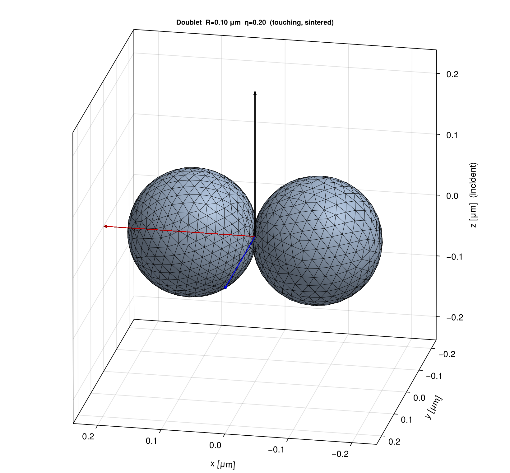
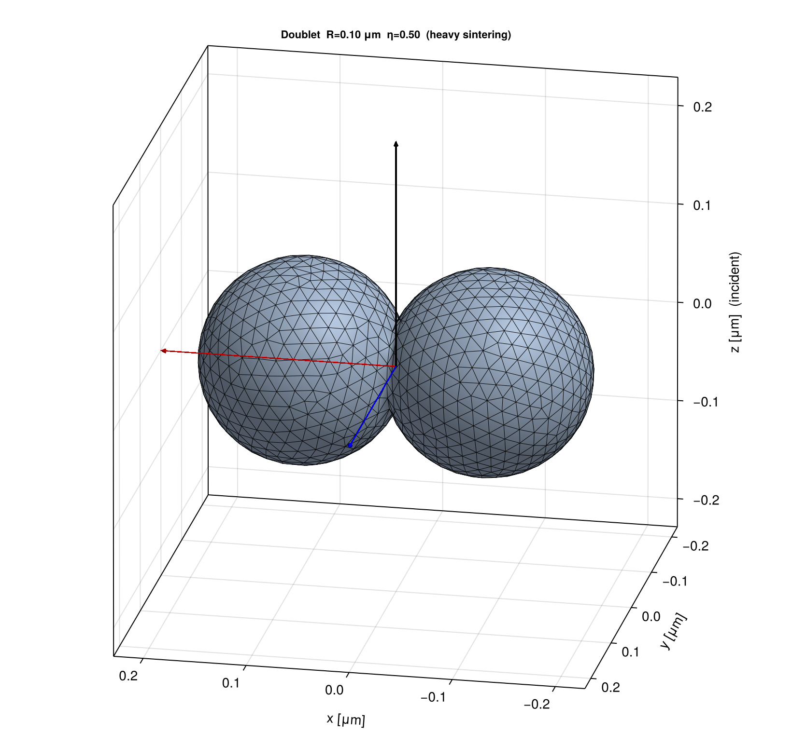
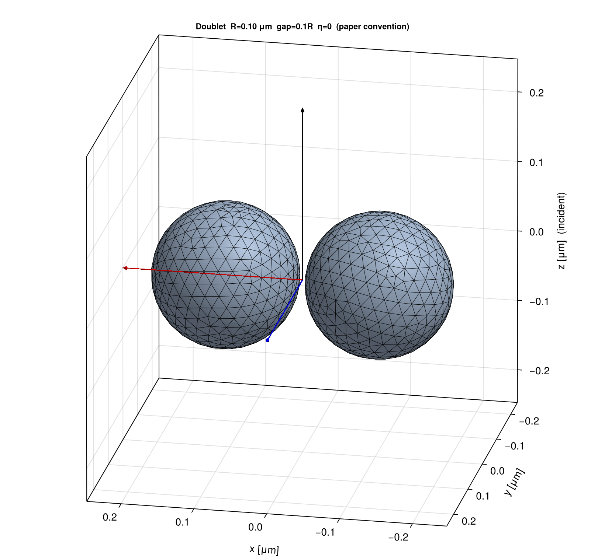
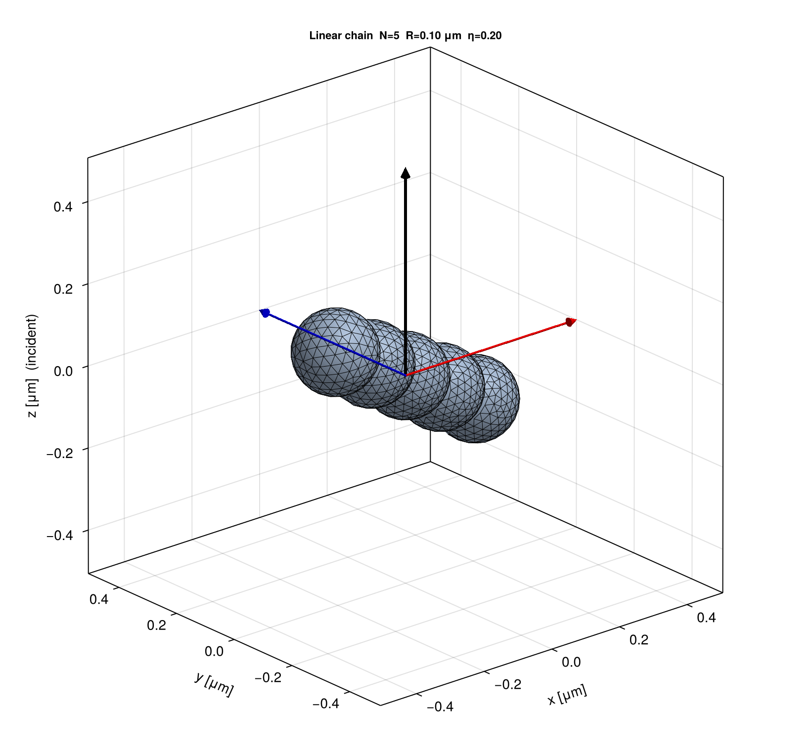
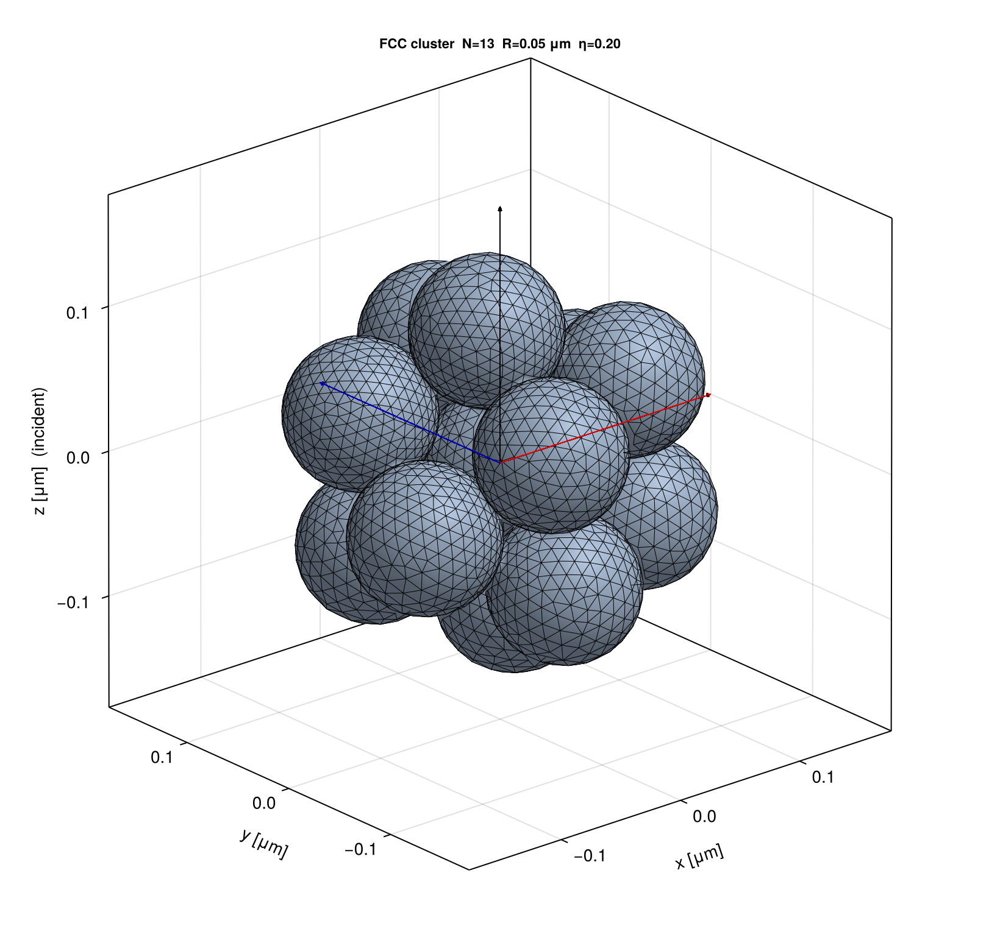
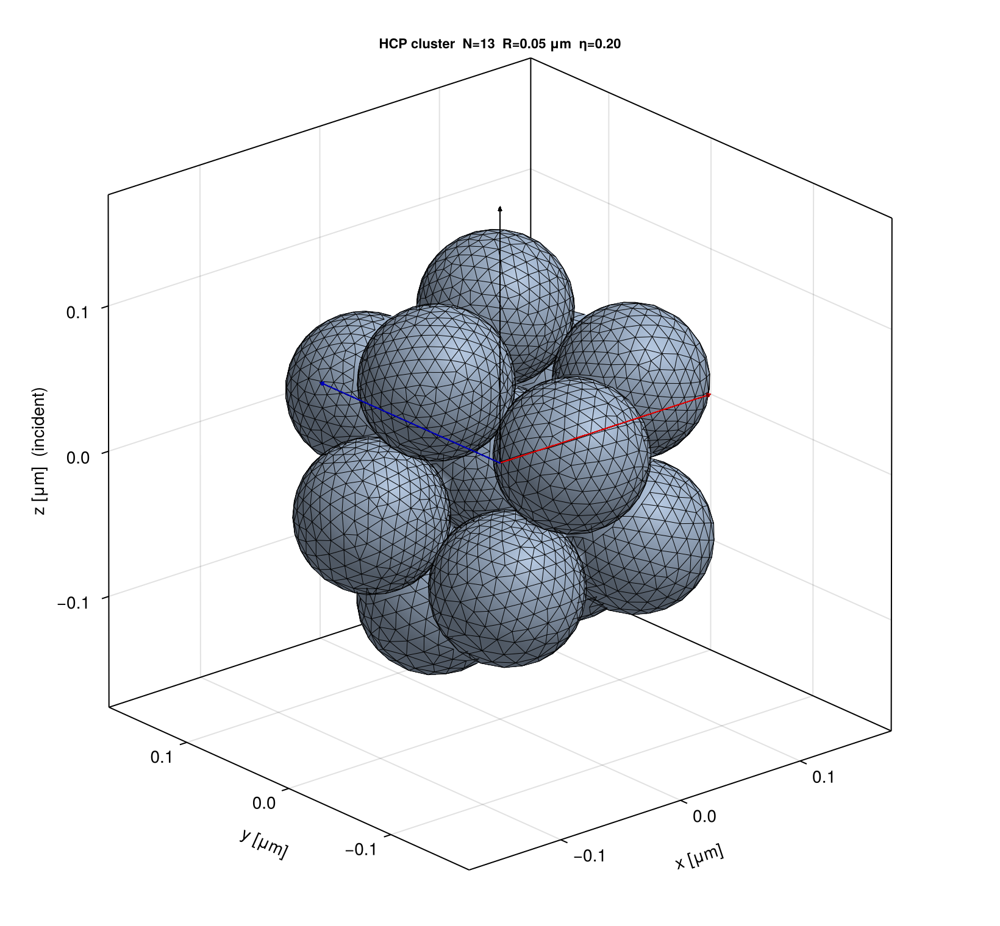
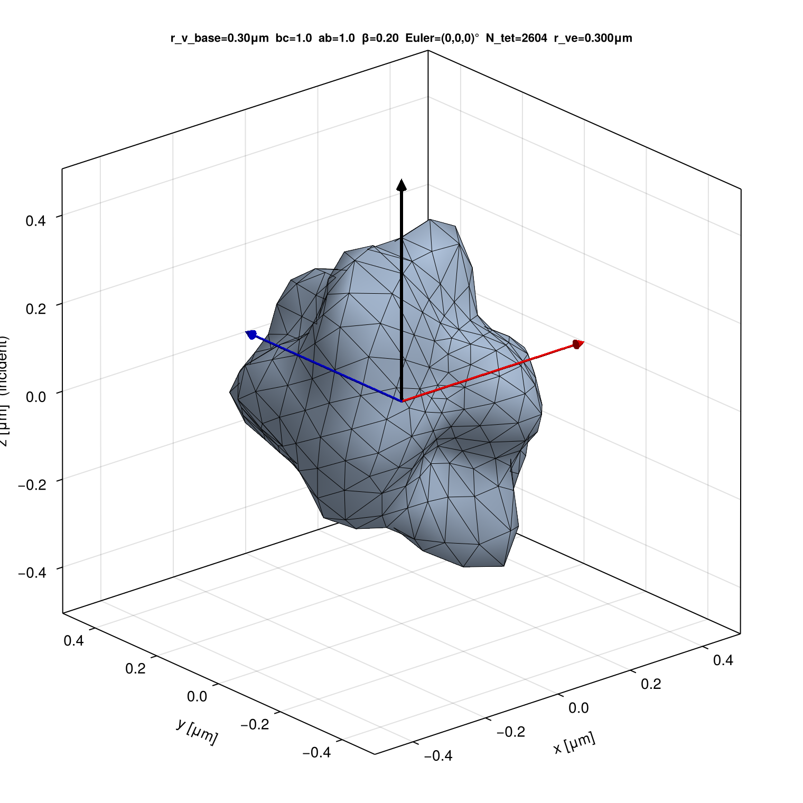

# Particle shape models, discretisation, and volume correction

This document is the authoritative reference for the two particle-shape
families supported by **block-VIEM.jl**:

1. **Gaussian Random Ellipsoid (GRE)** — a continuous-surface model
   defined by four scalar parameters, used for irregular but
   topologically simple particles (mineral dust, ice analogues,
   single-grain pollutants).
2. **Sphere aggregates** — a discrete-monomer model defined by a list of
   monomer centres and radii, used for clusters and chains
   (soot, fractal aerosols, doublet/multiplet benchmarks).

Both classes are discretised into a single conforming tetrahedral mesh
that the SWG / half-SWG basis is built on (see
[theory_note §3.2](theory_note.tex)). The two pipelines share the same
volume-preserving rescale step (v0.7.7+) so the discretised mesh
volume matches the user-specified target to machine precision; this
step removes a small ($\lesssim 1\,\%$) discretisation-volume bias from
cross-solver paper plots against the sister project
[block-DDA_Py](file:///home/moteki/Python/block-DDA_Py/CLAUDE.md).

The reader is assumed to know:

- The VIEM volume-equivalent radius convention $r_{ve}$ (see
  [theory_note §2.1](theory_note.tex)).
- That all lengths use the same physical unit throughout the API
  (paper-production code uses **μm**).
- The lab-frame convention $\hat{\bm z} = $ incident beam direction,
  particle orientation parameterised by intrinsic ZYZ Euler angles
  $(\alpha, \beta, \gamma)$, identical to the
  `scipy.spatial.transform.Rotation.from_euler("ZYZ", ...)` used by
  block-DDA_Py.

---

## 1. Common conventions

### 1.1 Particle frame and base ellipsoid

Both shape families are constructed in a **particle frame** in which the
geometry is defined without reference to the incident beam. Lab-frame
nodes are obtained by applying the rotation matrix $R = R_z(\alpha)
R_y(\beta) R_z(\gamma)$ to particle-frame node coordinates at solve
time.

For GRE the particle-frame x/y/z axes coincide with the major/inter-
mediate/minor semi-axes of the base ellipsoid ($a \ge b \ge c$, with
$c$ along z). For aggregates the particle-frame origin is the
**volume-weighted centroid** of the unrotated monomer set
(`recenter!` in [src/aggregate_mesh.jl:124-135](../src/aggregate_mesh.jl#L124-L135)).

### 1.2 Volume-equivalent radius

For any target shape $\Omega$ of physical volume $V_\Omega$, the
volume-equivalent radius is

$$
r_{ve} \;=\; \left(\tfrac{3 V_\Omega}{4\pi}\right)^{1/3},
$$

i.e. the radius of a sphere with the same volume. All cross sections
are reported in the form $Q_\bullet = C_\bullet / (\pi r_{ve}^2)$
(`a_eq` in the runner scripts and HDF5 schema is the same quantity as
$r_{ve}$).

### 1.3 Mesh container

Tetrahedral meshes are stored in `TetMesh`
([src/mesh.jl:11-95](../src/mesh.jl#L11-L95)) with cached per-tet
volumes, centroids, and physical-group tags. The two helpers used by
this document are

- `total_volume(mesh) :: Float64` — Σ tet volumes
  ([src/mesh.jl:107-109](../src/mesh.jl#L107-L109)),
- `apply_scale!(mesh, s)` — multiply all node coordinates by a scalar
  $s$ and rescale cached volumes by $s^3$
  ([src/mesh.jl:112-130](../src/mesh.jl#L112-L130)).

### 1.4 Volume-preserving rescale (v0.7.7+)

Because Gmsh discretises a curved surface with planar facets, the raw
mesh volume $V_\text{mesh}$ is biased away from the analytical target
$V_\text{target}$ by a small amount ($\sim$ a few tenths of a percent
at the paper-production mesh density). At the very end of mesh
generation both pipelines apply

$$
s \;=\; \left(\frac{V_\text{target}}{V_\text{mesh}}\right)^{1/3},
\qquad
\text{`apply\_scale!(mesh, s)`},
\tag{R}
$$

so the post-rescale mesh volume equals $V_\text{target}$ to machine
precision. The targets are:

| Family | $V_\text{target}$ | Rescale invariant |
| --- | --- | --- |
| GRE | $(4\pi/3)\,r_\text{v,base}^3$ | $r_{ve} = r_\text{v,base}$ exactly |
| Aggregate | $\sum_j (4\pi/3)\,r_j^3$ (overlaps ignored) | sum of ideal monomer volumes |

The rescale is uniform, so every angular ratio (semi-axis ratios for
GRE; neck-to-radius ratio and inter-monomer angles for aggregates) is
preserved. Absolute lengths shrink or grow by the factor $s$; the
implications for aggregate neck width are analysed in §2.5.

The block-DDA_Py companion enforces the same invariant via a
spacing/lattice adjustment in `Target.__init__`, which is why
cross-solver scattering-amplitude correlation plots are now bias-free
at the level of the rescale itself.

---

## 2. Sphere-aggregate shape model

### 2.1 Geometric data type

```julia
struct SphereAggregate
    centers ::Matrix{Float64}   # shape (3, N), column-major
    radii   ::Vector{Float64}   # length N
    metadata::Dict{String,Any}
end
```

defined in [src/aggregate_mesh.jl:55-71](../src/aggregate_mesh.jl#L55-L71).
All lengths are in the same physical unit (μm in paper code). The type
imposes only the structural invariants (shape, positivity); it does not
test whether monomers overlap.

### 2.2 Built-in generators and the `gap` parameter

For deterministic test geometries the package provides:

| Generator | Description | Signature |
| --- | --- | --- |
| `make_linear_chain(N, R; gap=0.0)` | $N$ equal monomers along the x-axis | [src/aggregate_mesh.jl:341](../src/aggregate_mesh.jl#L341) |
| `make_planar_array(nx, ny, R; lattice, gap)` | square or triangular 2-D lattice in $z = 0$ | [src/aggregate_mesh.jl:374](../src/aggregate_mesh.jl#L374) |
| `make_fcc_cluster(R; cluster_radius, gap)` | FCC sphere within a bounding sphere | [src/aggregate_mesh.jl:430](../src/aggregate_mesh.jl#L430) |
| `make_bcc_cluster(R; cluster_radius, gap)` | BCC sphere | [src/aggregate_mesh.jl:453](../src/aggregate_mesh.jl#L453) |
| `make_hcp_cluster(R; cluster_radius, gap)` | HCP sphere | [src/aggregate_mesh.jl:477](../src/aggregate_mesh.jl#L477) |

Random fractal-like aggregates are loaded from PTSA HDF5 files via
`load_ptsa_h5` ([src/aggregate_mesh.jl:259-294](../src/aggregate_mesh.jl#L259-L294)).

The keyword **`gap`** in every generator sets the centre-to-centre
distance for adjacent monomers:

$$
d_{ij}^\text{nn} \;=\; 2 R + \text{`gap`}, \qquad \text{`gap`} \ge 0.
$$

`gap = 0` means **tangent contact** (point-touching); `gap > 0` means
**disjoint** monomers separated by a vacuum gap of width `gap`. The
generators do not allow `gap < 0`; geometric overlap is created only
by the meshing-stage neck model (next subsection).

### 2.3 Neck modelling: `overlap_factor` and `neck_ratio`

Point contact between two spheres is both **physically degenerate**
(the VIEM electric field has a logarithmic singularity at the contact
point) and **numerically fragile** for the OpenCASCADE boolean union.
For tangent-touching configurations the meshing pipeline therefore
inflates every monomer radius by a factor $(1 + \varepsilon)$ before
fusing, producing an explicit neck of finite radius at every contact.

For two equal spheres of radius $r$ originally at centre distance
$d = 2r$ (tangent), the resulting **neck radius** (= radius of the
intersection circle of the two inflated spheres) is

$$
\frac{a_\text{neck}}{r} \;=\; \sqrt{(1+\varepsilon)^2 - 1}
\;\equiv\; \eta,
\tag{N1}
$$

derived from the Pythagorean construction at the centre plane (the
intersection plane is at distance $r$ from each centre, the inflated
radius is $(1+\varepsilon)r$). The dimensionless quantity $\eta =
a_\text{neck}/r$ is called the **`neck_ratio`** in this codebase. The
inverse mapping is

$$
\varepsilon \;=\; \sqrt{1 + \eta^2} - 1
\;=\; \tfrac{1}{2}\eta^2 - \tfrac{1}{8}\eta^4 + \mathcal{O}(\eta^6),
\tag{N2}
$$

so for small necks $\varepsilon \approx \tfrac{1}{2}\eta^2$ and
equivalently $\eta \approx \sqrt{2\varepsilon}$. Helpers
`neck_ratio_to_overlap` and `overlap_to_neck_ratio` are at
[src/aggregate_mesh.jl:154-170](../src/aggregate_mesh.jl#L154-L170).

#### Range and physical meaning of $\eta$

The implementation enforces $\eta \in [0, 1)$:

| $\eta$ | $\varepsilon$ | Physical interpretation |
| --- | --- | --- |
| $0$ | $0$ | Point contact — degenerate (forbidden if `gap = 0`) |
| $0.10$ | $0.005$ | Very weak van-der-Waals / sintering neck |
| $0.20$ | $0.020$ | API default for PTSA aggregates |
| $0.50$ | $0.118$ | Heavy partial sintering |
| $\to 1$ | $\to \sqrt{2} - 1 \approx 0.414$ | Neck radius equals monomer radius (dumbbell limit) |
| $\ge 1$ | $\ge \sqrt{2}-1$ | One centre lies on or inside the other sphere — geometry breaks down |

The literature on aerosol sintering uses $\eta$ as the **sintering
parameter** that captures the maturity of a neck under coalescence
kinetics. Choosing $\eta$ as the user-facing knob (rather than
$\varepsilon$) is convenient because $\eta$ is the linear
neck-thickness scale: doubling $\eta$ doubles the neck radius,
whereas doubling $\varepsilon$ only multiplies the neck radius by
$\sqrt{2}$.

#### Polydisperse pairs

For two unequal monomers $r_i \ne r_j$ inflated by the **common**
factor $s = 1 + \varepsilon$, with original centre distance
$d_{ij}$, the actual neck radius is computed exactly by
`pair_neck_radius`
([src/aggregate_mesh.jl:191-212](../src/aggregate_mesh.jl#L191-L212)) via

$$
a_\text{neck}^{\,ij} \;=\; \sqrt{R_i^2 - h_i^2},
\quad
h_i \;=\; \frac{d_{ij}^2 + R_i^2 - R_j^2}{2 d_{ij}},
\quad R_i = s\,r_i,\; R_j = s\,r_j.
\tag{N3}
$$

Substituting the tangent condition $d_{ij} = r_i + r_j$ and applying
the Heron-like factorisation to (N3) gives the symmetric form

$$
\bigl(a_\text{neck}^{\,ij}\bigr)^2
\;=\; \frac{(s^2 - 1)\,\bigl[\,(1 - s^2)(r_i^2 + r_j^2) + 2(1 + s^2)\,r_i r_j\,\bigr]}{4}.
\tag{N4}
$$

Setting $r_i = r_j = r$ collapses the bracket to $4 r^2$ and recovers
(N1).

A consequence of (N4) is that **the scalar `neck_ratio` parameter is
well-defined as a target only in the equal-radius case**. For
polydisperse aggregates the API uses what the comments call the
**equal-radius convention**:

> Solve $\eta \mapsto \varepsilon$ via (N2) as if all monomers were
> equal, then apply that single $\varepsilon$ uniformly to every
> monomer. The actual per-pair neck radii follow from (N4).

For typical aerosol polydispersity (relative standard deviation
$\lesssim 0.3$) the per-pair $a_\text{neck}^{\,ij}/r_*$ scatters by
only a few percent around the nominal $\eta$. For strongly
polydisperse or strongly sintered cases one should evaluate (N4) per
pair before publishing $\eta$ as a single number.

### 2.4 Tetrahedral meshing via Gmsh OpenCASCADE

`mesh_sphere_aggregate(agg; ...)`
([src/aggregate_mesh.jl:640-727](../src/aggregate_mesh.jl#L640-L727))
performs the following steps:

1. Resolve the inflation factor:
   $\varepsilon = $ `neck_ratio_to_overlap(neck_ratio)` if
   `neck_ratio` is given, else the explicit `overlap_factor`
   keyword (default `0.02`, i.e. $\eta \approx 0.20$).
2. Resolve the characteristic mesh size $\ell_c$ from `lc` if given,
   else from `adaptive_lc_aggregate` (§2.6).
3. Create one OCC sphere per monomer at radius $(1+\varepsilon) r_j$
   centred at `centers[:, j]`.
4. **Boolean fuse all spheres into a single (or few disjoint) volumes.**
   For overlapping inflated spheres OCC merges them into one volume
   whose surface includes the necks. For disjoint inflated spheres
   (`gap > 0` with $\varepsilon = 0$) OCC returns several volumes,
   all of which are tagged as physical group 1 (one material per the
   GRE convention).
5. Generate the 3-D tetrahedral mesh with
   `Mesh.CharacteristicLengthMin = Max = lc_eff`.
6. Read the `.msh` back into a `TetMesh`, then apply the
   volume-preserving rescale of §1.4 (unless the caller passes
   `rescale_to_target_volume = false`, used by the analytical
   overlap-volume validation tests).

The result is a **single conforming mesh** spanning the whole
aggregate: every interior node is shared by exactly one set of
adjacent tets, every interior face is shared by two tets, and the
SWG/half-SWG basis on this mesh resolves the internal $\bm D$ field
across every neck without any implicit boundary condition.

### 2.5 Interaction of rescale with neck width

Combining (N1) with (R) gives the post-rescale absolute neck width

$$
a_\text{neck}^\text{after}
\;=\; s\cdot r\cdot\sqrt{(1+\varepsilon)^2 - 1}
\;=\; s\cdot r\cdot \eta_\text{nominal}.
$$

Since both the neck and the monomer are scaled isotropically by
$s$, the ratio $a_\text{neck}/r_\text{eff}$ stays **exactly equal to
$\eta_\text{nominal}$**; only the absolute size of the aggregate
changes. For an equal-radius cluster with coordination number $Z$
(average number of contacts per monomer) the rescale factor is
approximately

$$
s \;\approx\; \left[(1+\varepsilon)^3 - \tfrac{Z}{2}\,\nu(\varepsilon)\right]^{-1/3},
\qquad \nu(\varepsilon) = \frac{V_\text{lens}(r,\varepsilon)}{(4\pi/3)\,r^3}.
$$

The lens-volume fraction $\nu(\varepsilon)$ scales like
$\varepsilon^{5/2}$ for small $\varepsilon$ and reaches a few-percent
levels at $\eta = 0.5$. Numerically:

| $\eta$ | $(1+\varepsilon)^3$ | $s$ (chain, $Z=2$) | Whole-aggregate shrinkage |
| --- | --- | --- | --- |
| $0.10$ | $1.015$ | $\approx 0.995$ | $-0.5\,\%$ |
| $0.20$ | $1.061$ | $\approx 0.980$ | $-2.0\,\%$ |
| $0.40$ | $1.276$ | $\approx 0.924$ | $-7.6\,\%$ |
| $0.70$ | $1.762$ | $\approx 0.831$ | $-16.9\,\%$ |

So **strong sintering does not invalidate the rescale (which still
preserves $V_\text{target}$ exactly), but it does mean the published
"monomer radius" $R$ corresponds to the post-rescale effective radius
$s R$, not to the pre-rescale nominal value**. Studies that fix
`neck_ratio` and want a fixed monomer radius should pre-compensate the
input radius by the inverse of the expected $s$, or skip rescale and
report the pre-rescale geometry.

For the disjoint case (`gap > 0` with `neck_ratio = 0`) the inflated
spheres do not overlap, $V_\text{mesh} \approx V_\text{target}$ up to
discretisation error, and $s \approx 1$.

### 2.6 Adaptive characteristic length

`adaptive_lc_aggregate`
([src/aggregate_mesh.jl:587-598](../src/aggregate_mesh.jl#L587-L598))
returns the smaller of the two mesh-resolution constraints:

$$
\ell_c \;=\; \min\!\left(\frac{\lambda_0}{|m_p|_\text{max}\, N_\text{pw}},\;
                            \frac{r_\text{min}}{N_\text{per\_radius}}\right),
$$

with paper-production defaults $N_\text{pw} = 10$ and
$N_\text{per\_radius} = 3$. The first term keeps at least
$N_\text{pw}$ tetrahedra per internal wavelength
$\lambda_0 / |m_p|$; the second keeps at least $N_\text{per\_radius}$
tetrahedra across the smallest monomer radius. The mesher's
`Mesh.CharacteristicLengthMin = Max = ℓ_c` setting then enforces this
length uniformly throughout the aggregate (Gmsh refines further only
where geometry curvature requires it).

### 2.7 Examples

All figures below are rendered by
[viz/visualize_aggregate.jl](../viz/visualize_aggregate.jl)
(`julia --project=viz viz/visualize_aggregate.jl`). The boundary
surface of the post-fuse merged volume is drawn as a fully opaque
solid with directional shading; mesh edges are then overlaid only
where they pass a per-edge **hidden-line removal** test
(backface culling plus a Möller–Trumbore ray test against every
other boundary triangle). This is required because CairoMakie has
no per-pixel depth test for line primitives, so a naive
`wireframe!` would (i) leak back-face edges through the opaque
surface and (ii) for non-convex bodies (doublets, chains, fused
clusters) also leak front-face edges that are physically blocked
by other parts of the same surface — both effects together would
visually mimic two distinct complete spheres regardless of
`neck_ratio`. Doublets are shown in broadside view (camera in the
+y direction with slight elevation) so the merged peanut waist —
or the gap between disjoint monomers — is on the silhouette and
immediately recognisable. The black/red/blue arrows mark the
lab-frame z (= incident beam) / x / y axes; the doublet axis is
along x. The mesh size $\ell_c$ is intentionally coarser than the
paper-production value for readability.

| Doublet, $\eta = 0.20$ (default sintering) | Doublet, $\eta = 0.50$ (heavy sintering) |
| :----------------------------------------: | :--------------------------------------: |
|  |  |
| $R = 0.10$ μm, tangent contact, fused via inflation | Same configuration, neck $\approx R/2$ |

| Doublet, `gap = 0.1·R`, $\eta = 0$ (paper convention) | Linear chain $N = 5$, $\eta = 0.20$ |
| :--------------------------------------------------: | :--------------------------------: |
|   |  |
| Disjoint monomers, no neck — used for the CAS-v2 doublet benchmark | Five monomers, four sintered necks |

| FCC cluster ($N \approx 13$) | HCP cluster ($N \approx 13$) |
| :--------------------------: | :--------------------------: |
|  |  |
| Close-packed cubic, $R = 0.05$ μm, $\eta = 0.20$ | Hexagonal close-packed, same parameters |

---

## 3. Gaussian Random Ellipsoid (GRE) shape model

### 3.1 Parameter set and base ellipsoid

The GRE shape is parameterised by the four scalars

```julia
struct GREParams
    r_v_base ::Float64   # volume-equivalent radius of base ellipsoid [μm]
    bc_ratio ::Float64   # b/c, ≥ 1, typical [1, 7]
    ab_ratio ::Float64   # a/b, ≥ 1, typical [1, 2]
    beta     ::Float64   # surface-deformation σ, ≥ 0, typical [0, 0.3]
end
```

defined in [src/gre_mesh.jl:39-52](../src/gre_mesh.jl#L39-L52). The base
ellipsoid has semi-axes $(a, b, c)$ with $c$ along $z$ and $a \ge b
\ge c$, related to $r_\text{v,base}$ by

$$
a b c \;=\; r_\text{v,base}^3,
\qquad
c = \left(\frac{r_\text{v,base}^3}{a/b\cdot (b/c)^2}\right)^{1/3},
\quad b = c\cdot(b/c),\; a = b\cdot(a/b).
$$

`bc_ratio = ab_ratio = 1` reduces to a sphere of radius
$r_\text{v,base}$; `bc_ratio > 1, ab_ratio = 1` is an oblate spheroid;
`bc_ratio > 1, ab_ratio > 1` is a triaxial ellipsoid.

### 3.2 Surface deformation field

For `beta = 0` the GRE is a clean ellipsoid. For `beta > 0` a
zero-mean log-normal radial deformation $\delta(\theta, \phi)$ is
added; the underlying Gaussian field $s(\theta, \phi)$ has covariance

$$
C(\bm r_1, \bm r_2) \;=\; \beta^2 \exp\!\left(-\frac{\|\bm r_1 - \bm r_2\|^2}{2 \ell_\text{corr}^2}\right),
\qquad \ell_\text{corr} = 0.3\, c,
\tag{G1}
$$

evaluated at points on the base ellipsoid surface. Cholesky
factorisation of $C$ on a coarse $(N_\theta, N_\phi)$ grid produces
$s_\text{coarse}$, which is bilinearly interpolated to a fine grid
that meshes the surface with sufficient angular resolution for the
final Gmsh deformation step
([src/gre_mesh.jl:116-280](../src/gre_mesh.jl#L116-L280)).

The radial deformation is

$$
\delta(\theta, \phi) \;=\; h_0\left(e^{s(\theta,\phi)} - \tfrac{1}{2}\beta^2 - 1\right),
\quad h_0 = \frac{c^2}{a},
\tag{G2}
$$

so that $\langle \delta \rangle = 0$ at first order in $\beta^2$
(the $-\tfrac{1}{2}\beta^2$ correction restores the zero-mean property
of the radial perturbation under the log-normal mapping). This is the
Muinonen–Pieniluoma 2011 JQSRT convention, identical to the one used
by the sister Python project.

### 3.3 Tetrahedral mesh generation

`gre_mesh(p, rng; ...)`
([src/gre_mesh.jl:504-552](../src/gre_mesh.jl#L504-L552)) performs:

1. Compute $(a, b, c)$ from $p$.
2. Resolve $\ell_c$ from `lc` if given, else from `adaptive_lc(p)`
   (§3.4).
3. Build a base-ellipsoid OCC volume (sphere dilated to $(a, b, c)$)
   and generate the 3-D tet mesh with characteristic length $\ell_c$.
4. **For $\beta > 0$**: deform every mesh node radially by

   $$
   \bm r_\text{new} \;=\; \bm r + \tilde r\cdot \delta(\theta, \phi)\,\hat{\bm n},
   $$

   where $\tilde r = \sqrt{(x/a)^2 + (y/b)^2 + (z/c)^2}\in[0, 1]$ is
   the normalised ellipsoidal radius (zero at the centre, unity on
   the surface) and $\hat{\bm n}$ is the outward unit normal of the
   base ellipsoid at that direction. This **radial scaling** keeps
   the mesh interior topologically intact while deforming only the
   surface neighbourhood, preserving Gmsh element quality.
5. Read the deformed mesh into a `TetMesh` and apply the
   volume-preserving rescale (§1.4) so that
   $r_{ve}^\text{after} = r_\text{v,base}$ exactly.

For cross-validation against block-DDA_Py, `gre_mesh_with_field`
([src/gre_mesh.jl:571-599](../src/gre_mesh.jl#L571-L599)) accepts a
pre-computed deformation field $s(\theta, \phi)$ so the same Gaussian
realisation can be shared between the two solvers.

### 3.4 Adaptive characteristic length

`adaptive_lc(p; wl_0, m_p_max, N_pw)`
([src/gre_mesh.jl:84-103](../src/gre_mesh.jl#L84-L103)) returns the
smallest of three constraints:

$$
\ell_c \;=\; \min\!\left(
   \underbrace{\frac{\lambda_0}{|m_p|_\text{max}\,N_\text{pw}}}_\text{wavelength},\;
   \underbrace{\frac{c}{N_\text{per\_radius}}}_\text{geometry},\;
   \underbrace{\frac{0.3\, c}{N_\text{per\_radius}}}_\text{correlation length, only if $\beta > 0$}
\right).
\tag{G3}
$$

Defaults are $N_\text{pw} = 10$, $N_\text{per\_radius} = 3$. The
correlation-length term ($\ell_\text{corr}/3 = 0.1\,c$) is what makes
GRE meshes substantially finer than smooth ellipsoid meshes once
$\beta > 0$.

### 3.5 Examples

Renderings produced by [viz/visualize_gre.jl](../viz/visualize_gre.jl)
(`julia --project=viz viz/visualize_gre.jl`).  As in §2.7 the
boundary surface is drawn as a fully opaque solid with directional
shading and front-face mesh edges overlaid; the same Möller–Trumbore
hidden-edge removal is applied so back-face edges and edges
self-occluded by surface concavities (which can develop in GREs
with strong $\beta$) are correctly suppressed.  All five shapes use
$r_\text{v,base} = 0.30$ μm and a coarsened mesh ($\ell_c = c/2.5$)
purely for wireframe readability — paper-production runs use the
adaptive value (G3).

| Sphere ($b/c = a/b = 1$, $\beta = 0$) | Oblate ($b/c = 3$, $\beta = 0$) | Triaxial ($b/c = 2$, $a/b = 1.5$, $\beta = 0$) |
| :--: | :--: | :--: |
|  |  |  |
| Euler $= (0°, 0°, 0°)$ | Euler $= (0°, 60°, 0°)$ | Euler $= (30°, 45°, 0°)$ |

| GRE ($b/c = 1$, $a/b = 1$, $\beta = 0.20$) | GRE ($b/c = 1.5$, $a/b = 1.5$, $\beta = 0.20$) |
| :--: | :--: |
|  |  |
| Euler $= (0°, 0°, 0°)$ | Euler $= (20°, 60°, 10°)$ |

---

## 4. Recommended usage patterns

| Physical scenario | Generator | `mesh_sphere_aggregate` keyword |
| --- | --- | --- |
| Paper doublet ($g = 0.1 R$, disjoint) | `make_linear_chain(2, R; gap=0.1R)` | `neck_ratio = 0` |
| Touching doublet, smallest physical neck | `make_linear_chain(2, R; gap=0)` | `neck_ratio = 0.05`–`0.10` |
| Sintered chain (physical neck) | `make_linear_chain(N, R; gap=0)` | `neck_ratio = 0.20`–`0.50` |
| PTSA fractal aggregate | `load_ptsa_h5(...)` | `overlap_factor = 0.02` (= $\eta \approx 0.20$, default) |
| Dense cluster of small monomers | `make_fcc_cluster` / `make_hcp_cluster` | `neck_ratio = 0.20` |
| GRE sphere reference | `GREParams(r_v_base, 1, 1, 0)` | (use `gre_mesh`) |
| GRE oblate spheroid | `GREParams(r_v_base, b/c, 1, 0)` | (use `gre_mesh`) |
| GRE irregular ($\beta > 0$) | `GREParams(r_v_base, b/c, a/b, β)` | (use `gre_mesh`) |

## 5. Cross-reference summary

| Concept | Source location |
| --- | --- |
| `SphereAggregate` data type | [src/aggregate_mesh.jl:55-71](../src/aggregate_mesh.jl#L55-L71) |
| Centroid + recentre helpers | [src/aggregate_mesh.jl:104-135](../src/aggregate_mesh.jl#L104-L135) |
| `neck_ratio_to_overlap` / `overlap_to_neck_ratio` | [src/aggregate_mesh.jl:154-170](../src/aggregate_mesh.jl#L154-L170) |
| `pair_neck_radius` (polydisperse exact neck) | [src/aggregate_mesh.jl:191-212](../src/aggregate_mesh.jl#L191-L212) |
| PTSA HDF5 I/O | [src/aggregate_mesh.jl:218-328](../src/aggregate_mesh.jl#L218-L328) |
| Built-in aggregate generators | [src/aggregate_mesh.jl:334-568](../src/aggregate_mesh.jl#L334-L568) |
| `adaptive_lc_aggregate` | [src/aggregate_mesh.jl:587-598](../src/aggregate_mesh.jl#L587-L598) |
| `mesh_sphere_aggregate` (Gmsh OCC fuse + rescale) | [src/aggregate_mesh.jl:640-727](../src/aggregate_mesh.jl#L640-L727) |
| `GREParams` data type | [src/gre_mesh.jl:39-52](../src/gre_mesh.jl#L39-L52) |
| `gre_semi_axes`, `adaptive_lc` (GRE) | [src/gre_mesh.jl:65-103](../src/gre_mesh.jl#L65-L103) |
| Gaussian-field sampling and interpolation | [src/gre_mesh.jl:116-280](../src/gre_mesh.jl#L116-L280) |
| `gre_mesh` (Gmsh OCC ellipsoid + node deformation + rescale) | [src/gre_mesh.jl:504-552](../src/gre_mesh.jl#L504-L552) |
| `gre_mesh_with_field` (cross-validation entry point) | [src/gre_mesh.jl:571-599](../src/gre_mesh.jl#L571-L599) |
| `apply_scale!`, `total_volume` | [src/mesh.jl:107-130](../src/mesh.jl#L107-L130) |
| GRE wireframe visualiser | [viz/visualize_gre.jl](../viz/visualize_gre.jl) |
| Aggregate wireframe visualiser | [viz/visualize_aggregate.jl](../viz/visualize_aggregate.jl) |
